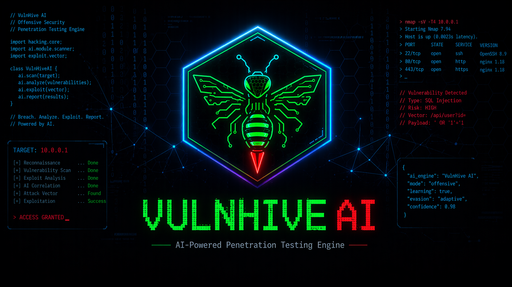

<p align="center">                                                                                                              
    
  </p> 

# VulnHive AI

An AI-powered, fully automated penetration testing engine. Give it a URL — it crawls the website, discovers every page and form, tests for 24 types of security vulnerabilities, validates what it finds, chains exploits together, and generates a professional report. All without human intervention.

Think of it as having a team of 24 specialized security researchers working in parallel, each one an expert in a different type of attack — SQL injection, cross-site scripting, subdomain takeover, and more — coordinated by an AI brain that decides what to test and in what order.

**83 Python files | 28,000+ lines of code | 24 vulnerability agents | 25 WAF fingerprints | 34 subdomain takeover checks**

> **IMPORTANT**: Only use this against applications you own or have explicit written authorization to test. Unauthorized testing is illegal. This tool is for educational purposes, CTF competitions, bug bounty programs, and authorized penetration testing engagements only.

---

## Table of Contents

- [What Does It Actually Do?](#what-does-it-actually-do)
- [How It Works (The Pipeline)](#how-it-works-the-pipeline)
- [Quick Start](#quick-start)
- [CLI Reference](#cli-reference)
- [Scan Modes](#scan-modes)
- [All 24 Vulnerability Agents](#all-24-vulnerability-agents)
- [Reconnaissance Features](#reconnaissance-features)
- [Exploit Engine](#exploit-engine)
- [Architecture](#architecture)
- [Project Structure](#project-structure)
- [LLM Integration](#llm-integration)
- [Reporting](#reporting)
- [Requirements](#requirements)
- [Disclaimer](#disclaimer)

---

## What Does It Actually Do?

Imagine you're a security tester. Normally you would:

1. Visit a website and click around to understand its structure
2. Look at the technology it uses (PHP? Node.js? WordPress?)
3. Check if there's a firewall protecting it
4. Try different attacks on every form, URL, and API endpoint
5. Figure out if each vulnerability is real or a false alarm
6. Write a detailed report with evidence and fix recommendations

**VulnHive AI automates all of this.** You give it one URL, and it does everything above — in minutes, not days.

### Real-World Example

```bash
python main.py --target https://your-app.com --auth-type form \
    --login-url https://your-app.com/login \
    --username testuser --password testpass \
    --exploit-chains --adaptive --report-dir ./reports
```

This single command will:
- Log into the application using the provided credentials
- Crawl every page it can reach (respecting depth limits)
- Analyze JavaScript files for hidden API endpoints
- Run WHOIS/DNS lookups to map the infrastructure
- Detect if a WAF (Web Application Firewall) is protecting the site
- Test every discovered endpoint with 24 specialized attack agents
- Validate each finding to eliminate false positives
- Try to chain vulnerabilities into multi-step attack paths
- Generate an HTML report with all findings, evidence, and remediation advice

---

## How It Works (The Pipeline)

 ```mermaid
 flowchart LR    
      A["URL"] --> B["Discovery"] --> C["Analysis"] --> D["Attack"] --> E["Validation"] --> F["Report"]                           
                                                                                                                                  
      B --- B1["Web Crawler"]
      B --- B2["JS Crawler"]                                                                                                      
      B --- B3["WAF Detection"]
      B --- B4["WHOIS/DNS"]                                                                                                       
      B --- B5["Subdomain Enum"]
                                                                                                                                  
      D --- D1["24 Vuln Agents"]                                                                                                  
      D --- D2["Adaptive Payloads"]
                                                                                                                                  
      F --- F1["HTML Report"]
      F --- F2["JSON Report"]
```
---

## Quick Start

### 1. Clone and install

```bash
git clone https://github.com/0xShyam-Sec/VulnHive-AI.git
cd VulnHive-AI
python3 -m venv venv
source venv/bin/activate
pip install -r requirements.txt
```

### 2. (Optional) Set up LLM backend

**Option A: Local LLM (free, private, no API key needed)**
```bash
# Install Ollama from https://ollama.com
ollama pull deepseek-r1:14b
```

**Option B: Anthropic Claude API (faster, more accurate)**
```bash
cp .env.example .env
# Edit .env and add: ANTHROPIC_API_KEY=sk-ant-...
```

### 3. Set up a practice target (optional)

```bash
docker compose up -d
# Visit http://localhost:8080
# Login: admin / password
# Go to http://localhost:8080/setup.php → click "Create / Reset Database"
```

### 4. Run your first scan

```bash
# Basic scan (no auth needed for public pages)
python main.py --target http://localhost:8080

# Authenticated scan
python main.py --target http://localhost:8080 --auth-type form \
    --login-url http://localhost:8080/login.php \
    --username admin --password password \
    --report-dir ./reports
```

---

## CLI Reference

### Basic Options

| Flag | Description | Default |
|------|-------------|---------|
| `--target URL` | Target URL to scan (required) | — |
| `--mode MODE` | Scan mode (see below) | `multi-agent` |
| `--task "..."` | Specific task instead of full scan | Full scan |
| `--llm {ollama,anthropic}` | LLM backend | `ollama` |
| `--output file.json` | Save findings to JSON | — |
| `--report-dir DIR` | Generate HTML + JSON reports | — |

### Authentication

| Flag | Description |
|------|-------------|
| `--auth-type {form,cookie,basic,bearer,none}` | How to authenticate |
| `--login-url URL` | Login page URL (for form auth) |
| `--username USER` | Username |
| `--password PASS` | Password |
| `--username-field name` | Form field name for username (default: `username`) |
| `--password-field name` | Form field name for password (default: `password`) |
| `--cookies '{"key":"val"}'` | JSON cookies (for cookie auth) |
| `--bearer-token TOKEN` | Bearer token (for bearer/API auth) |
| `--success-indicator TEXT` | Text that confirms login worked |

### Engines

| Flag | Description |
|------|-------------|
| `--exploit-chains` | Enable multi-step exploit chain discovery |
| `--adaptive` | Enable adaptive payload engine (auto WAF bypass) |

### Full Example

```bash
python main.py \
    --target https://example.com \
    --mode multi-agent \
    --auth-type bearer \
    --bearer-token "eyJhbGciOi..." \
    --wordlist ~/SecLists/Discovery/DNS/subdomains-top1million-5000.txt \
    --rate-limit 100 \
    --scan-all \
    --exploit-chains \
    --adaptive \
    --report-dir ./reports \
    --output findings.json
```

---

## Scan Modes

| Mode | What it does | Best for |
|------|-------------|----------|
| `multi-agent` | Runs all 24 vuln agents coordinated by AI (default) | Full security assessment |
| `systematic` | Crawls + tests every form and parameter methodically | Thorough coverage |
| `agent` | Single AI agent with tool access (ReAct loop) | Targeted tasks |
| `browser` | Uses Playwright headless browser for JS-heavy apps | SPAs, React/Angular apps |
| `api` | Focused on REST/GraphQL API endpoints | API-only testing |
| `full` | Runs systematic + agent + browser + API combined | Maximum coverage |

---

## All 24 Vulnerability Agents

Each agent is a specialist — it only tests for one type of vulnerability, but it does it thoroughly.

### Injection Attacks

| Agent | What it finds | Why it matters |
|-------|--------------|----------------|
| **SQL Injection** | Database queries that accept user input unsafely | Attacker can read/modify/delete your entire database |
| **Command Injection** | OS commands that include user input | Attacker can run any command on your server |
| **SSTI** | Template engines that execute user input as code | Attacker can execute arbitrary code on the server |
| **XXE** | XML parsers that process external entities | Attacker can read server files and make internal requests |
| **XSS** | User input reflected in HTML without sanitization | Attacker can steal cookies, redirect users, deface pages |

### Authentication & Authorization

| Agent | What it finds | Why it matters |
|-------|--------------|----------------|
| **Auth Bypass** | Ways to access protected pages without logging in | Attacker skips your login entirely |
| **IDOR** | Direct object references without access checks | Attacker accesses other users' data by changing IDs |
| **IDOR Advanced** | Complex IDOR with UUID/hash guessing | Same as IDOR but harder to detect |
| **JWT** | Weak JSON Web Token signing (alg=none, key confusion) | Attacker forges authentication tokens |
| **CSRF** | Missing CSRF tokens on state-changing forms | Attacker tricks users into performing actions |

### Infrastructure & Network

| Agent | What it finds | Why it matters |
|-------|--------------|----------------|
| **Subdomain Enum** | Hidden subdomains, DNS misconfigs, takeover vulns | Finds forgotten servers, staging environments, admin panels |
| **SSRF** | Server making requests to attacker-controlled URLs | Attacker accesses internal services from the outside |
| **Open Redirect** | URLs that redirect to arbitrary destinations | Used in phishing attacks to appear legitimate |
| **HTTP Smuggling** | Request parsing disagreements between frontend/backend | Attacker poisons cache, bypasses security, hijacks requests |

### Application Logic

| Agent | What it finds | Why it matters |
|-------|--------------|----------------|
| **Mass Assignment** | API accepting fields it shouldn't (role, isAdmin) | Attacker promotes themselves to admin |
| **Business Logic** | Flaws in application logic (price manipulation, etc.) | Attacker exploits the business rules themselves |
| **Rate Limit** | Missing rate limiting on sensitive endpoints | Attacker brute-forces passwords, OTPs, discount codes |
| **File Upload** | Unrestricted file uploads (shells, polyglots) | Attacker uploads code that runs on the server |

### API & Protocol

| Agent | What it finds | Why it matters |
|-------|--------------|----------------|
| **GraphQL** | Introspection enabled, batching attacks, depth abuse | Attacker maps and exhausts your entire API |
| **API Versioning** | Old API versions with missing patches | Attacker uses deprecated endpoints that lack new security |
| **WebSocket** | WebSocket injection, hijacking, auth bypass | Real-time communication channels without proper security |

### Detection & Headers

| Agent | What it finds | Why it matters |
|-------|--------------|----------------|
| **Security Headers** | Missing X-Frame-Options, CSP, HSTS, etc. | Enables clickjacking, XSS, downgrade attacks |
| **Sensitive Data** | Exposed .env, .git, backups, config files | Attacker finds database passwords, API keys, source code |
| **Cache Poisoning** | Manipulating cached responses with unkeyed headers | Attacker serves malicious content to all users via cache |
| **Path Traversal** | Reading files outside the web root (../../etc/passwd) | Attacker reads any file on the server |

---

## Reconnaissance Features

### Web Crawler
- Breadth-first crawling with configurable depth and page limits
- Form extraction (all inputs, actions, methods)
- Parameter discovery (URL params + form fields)
- Technology detection (PHP, Django, Express, WordPress, etc.)
- Follows navigation dropdowns and JavaScript redirects
- Playwright headless browser for single-page applications

### Deep JavaScript Crawler
Fetches ALL `.js` files across the entire site — not just the homepage — and extracts hidden API endpoints that aren't linked in the UI.

- **5-phase pipeline**: page crawl → path brute-force → download + follow refs → source maps → inline scripts
- **14 route patterns**: React Router, Vue Router, Angular, Next.js, Express, GraphQL, `fetch()`/`axios` calls, and more
- **Source map analysis**: downloads `.map` files to get original un-minified code
- **Webpack chunk following**: recursively discovers dynamically loaded JS
- **Secret detection**: AWS keys, JWT tokens, GitHub tokens, API keys, hardcoded passwords

### WAF Detection (25 WAFs)
Identifies which Web Application Firewall protects the target, then loads specific bypass strategies.

| Category | WAFs Detected |
|----------|--------------|
| CDN / Cloud | Cloudflare, AWS WAF, Akamai, Imperva, Fastly, Sucuri |
| Server-level | ModSecurity (OWASP CRS), F5 BIG-IP ASM |
| Platform | Azure Front Door, Google Cloud Armor, Barracuda, Fortinet, Citrix NetScaler |
| CMS / App | Wordfence, Wallarm, Reblaze, StackPath, and 10+ more |

Detection methods:
- **Passive**: header fingerprinting, cookie patterns, server header
- **Active**: 8 trigger payloads (XSS, SQLi, LFI, CMDi, bot UA) → fingerprint block pages
- **Output**: WAF name, confidence level, and specific bypass hints for the payload engine

### WHOIS + DNS Enumeration
Pulls full domain intelligence without touching the target's servers.

- **WHOIS**: registrar, creation/expiry dates, nameservers, registrant organization
- **DNS Records**: A, AAAA, CNAME, MX, NS, TXT, SOA, SRV, CAA + AXFR zone transfer attempt
- **TXT Analysis**: 17 token patterns — SPF, DKIM, DMARC, Google/Facebook/Microsoft/Apple/Stripe/Zoom/Atlassian verification tokens
- **SPF Misconfiguration**: flags `+all` (anyone can spoof email), `~all`, `?all`
- **DMARC Check**: flags missing DMARC or `p=none` (no spoofing protection)
- **Reverse DNS**: PTR lookups to identify hosting provider (AWS, GCP, etc.)
- **Domain Expiry**: warns if domain expires within 30 days (takeover risk)

### Subdomain Enumeration
Finds all subdomains of the target — including ones the company forgot about.

- **Passive OSINT**: crt.sh (certificate transparency) + Wayback Machine
- **Active brute-force**: 360 built-in words + custom wordlist support (`--wordlist`)
- **Permutation engine**: generates `dev-api`, `api-v2`, `api2` variants from discovered subs
- **Recursive enum**: finds `dev.api.example.com` style sub-subdomains
- **Async DNS**: uses `aiodns` for 5-10x faster resolution (falls back to socket if not installed)
- **Rate limiting**: `--rate-limit` flag for controlled scanning
- **HTTP alive probing**: checks which subdomains actually serve web content
- **34 takeover fingerprints**: GitHub Pages, Heroku, S3, Azure, Netlify, Vercel, Shopify, and 27 more
- **Multi-host deep scan**: `--scan-all` flag to scan all alive subdomains, not just the first

---

## Exploit Engine

### Adaptive Payload Engine
When a basic payload gets blocked by a WAF, the engine automatically tries bypass variants:
- Encoding mutations (URL, double-URL, Unicode, hex, overlong UTF-8)
- Case alternation (`sElEcT` instead of `SELECT`)
- Inline comments (`SEL/**/ECT`)
- Null bytes, chunked transfer, content-type switching
- 4 payload libraries: SQLi (338 lines), XSS (312 lines), CMDi (384 lines), SSTI (405 lines)

### Exploit Chain Engine
Combines individual vulnerabilities into multi-step attack paths:
- XSS → session hijack → admin access
- SQLi → data extraction → credential dump → RCE
- SSRF → internal service access → privilege escalation
- Validates each chain end-to-end to confirm it works

### Deduplication Engine
Runs BEFORE validation to eliminate duplicate findings early. This makes scans **90% faster** because we don't waste time re-validating the same vulnerability found through different paths.

---

## Architecture

```
CLI (main.py)
  |
  +-- Pipeline (pipeline.py) / Scan Runner (engine/scan_runner.py)
       |
       +-- Discovery Layer
       |     |-- Web Crawler (crawler.py)
       |     |-- Playwright Browser Crawler (discovery/playwright_crawler.py)
       |     |-- Deep JS Crawler (js_analyzer.py)
       |     |-- Passive Recon (discovery/passive_recon.py)
       |     |-- WAF Detector (discovery/waf_detector.py)
       |     |-- WHOIS + DNS (discovery/whois_dns.py)
       |     +-- API Schema Inference (discovery/api_schema_inference.py)
       |
       +-- Decision Engine (engine/decision_engine.py)
       |     |-- Priority Scorer (engine/priority_scorer.py)
       |     |-- Reactive Rules (engine/reactive_rules.py)
       |     +-- Agent Registry (engine/agent_registry.py)
       |
       +-- 24 Vulnerability Agents (agents/vuln/*.py)
       |     |-- Coordinated by Orchestrator (agents/orchestrator.py)
       |     +-- Powered by Base Agent (agents/base.py)
       |
       +-- Exploit Engine
       |     |-- Adaptive Payloads (payload_engine.py)
       |     |-- Chain Builder (exploit_chain.py)
       |     |-- Filter Detector (exploit/filter_detector.py)
       |     +-- 4 Payload Libraries (exploit/payload_library/*.py)
       |
       +-- Validation + Reporting
             |-- Validator (validator.py)
             |-- Deduplicator (engine/deduplicator.py)
             |-- Confidence Scorer (confidence_scorer.py)
             +-- Report Engine (report_engine.py) → HTML + JSON
```

---

## Project Structure

<details>                                                                                                                       
  <summary><strong>Root Files</strong> — CLI, scanning, crawling, auth, reporting (22 files)</summary>
                                                                                                                                  
  | File | Purpose |
  |------|---------|                                                                                                              
  | `main.py` | CLI entry point — parses all flags, builds auth config, runs scan |
  | `pipeline.py` | Scan mode orchestration — systematic, agent, browser, API, multi-agent, full |                                
  | `agent.py` | Single-agent ReAct loop (Reason → Act → Observe) |
  | `scanner.py` | Core scanning logic |                                                                                          
  | `crawler.py` | BFS web crawler — forms, params, links, tech detection |
  | `browser.py` | Playwright browser automation for JS-heavy apps |                                                              
  | `js_analyzer.py` | Deep JS crawler — source maps, webpack chunks, 14 route patterns, secret scanner |
  | `auth.py` | Authentication handlers — form, cookie, basic, bearer |                                                           
  | `oauth_handler.py` | OAuth 2.0 authorization flows |
  | `session_manager.py` | Session persistence + automatic re-authentication |                                                    
  | `autodiscover.py` | Black-box target recon — login pages, tech stack, robots.txt, sitemap |                                   
  | `validator.py` | Re-validates findings to eliminate false positives |
  | `confidence_scorer.py` | Scores finding confidence levels |                                                                   
  | `enrichment.py` | CVSS scoring + remediation advice |
  | `payload_engine.py` | Adaptive WAF bypass — mutates blocked payloads automatically |                                          
  | `exploit_chain.py` | Multi-step exploit chain builder |
  | `report_engine.py` | HTML + JSON professional report generation |                                                             
  | `api_scanner.py` | API-focused scanning (REST + GraphQL) |
  | `openapi_importer.py` | Swagger/OpenAPI spec import |                                                                         
  | `traffic_recorder.py` | Records all HTTP traffic during scan |                                                                
  | `tools.py` | Tool schemas and dispatch for agent tool-use |
  | `blackbox.py` | Black-box multi-agent mode |                                                                                  
                                                                                                                                  
  </details>
                                                                                                                                  
  <details>       
  <summary><strong>engine/</strong> — Scan Engine Core (8 files)</summary>

  | File | Purpose |
  |------|---------|
  | `config.py` | Centralized scan configuration (LLM, rate limits, auth, cookies) |
  | `scan_state.py` | Thread-safe shared state (endpoints, findings, WAF info, lead queue) |                                      
  | `scan_runner.py` | Unified scan runner — ties discovery, agents, validation, chains, reports |
  | `decision_engine.py` | Picks which agent tests which endpoint + priority |                                                    
  | `agent_registry.py` | Dynamic agent registration and dispatch |
  | `priority_scorer.py` | Scores endpoints by attack value |                                                                     
  | `reactive_rules.py` | Event-driven rules (finding X triggers agent Y) |
  | `deduplicator.py` | Deduplicates + aggregates findings (runs before validation — 90% speedup) |                               
   
  </details>                                                                                                                      
                  
  <details>
  <summary><strong>agents/</strong> — 24 Vulnerability Agents + orchestration (29 files)</summary>
                                                                                                                                  
  | File | Purpose |
  |------|---------|                                                                                                              
  | `base.py` | Base agent — supports Ollama + Anthropic backends |
  | `orchestrator.py` | Multi-agent coordinator — runs discovery then dispatches vuln agents |                                    
  | `validator.py` | Validation agent |
  | `recon.py` | Reconnaissance agent |                                                                                           
  | `chain.py` | Exploit chaining agent |
  | `vuln/sqli.py` | SQL injection (error, blind, time-based, UNION) |                                                            
  | `vuln/xss.py` | Cross-site scripting (reflected, stored, DOM) |
  | `vuln/csrf.py` | Cross-site request forgery |                                                                                 
  | `vuln/ssrf.py` | Server-side request forgery |
  | `vuln/idor.py` | Insecure direct object reference |                                                                           
  | `vuln/idor_advanced.py` | Complex IDOR with UUID/hash guessing |
  | `vuln/cmdi.py` | OS command injection |                                                                                       
  | `vuln/path_traversal.py` | LFI/RFI directory traversal |
  | `vuln/open_redirect.py` | Unvalidated redirects |                                                                             
  | `vuln/mass_assignment.py` | Parameter binding abuse |                                                                         
  | `vuln/graphql.py` | GraphQL introspection, batching, depth attacks |
  | `vuln/headers.py` | Security header misconfigurations |                                                                       
  | `vuln/sensitive_data.py` | Exposed files, info leakage |                                                                      
  | `vuln/ssti.py` | Server-side template injection |
  | `vuln/xxe.py` | XML external entity injection |                                                                               
  | `vuln/jwt.py` | JWT alg=none, key confusion, weak signing |                                                                   
  | `vuln/http_smuggling.py` | CL/TE request smuggling |
  | `vuln/cache_poison.py` | Web cache poisoning |                                                                                
  | `vuln/file_upload.py` | Unrestricted file upload |                                                                            
  | `vuln/websocket.py` | WebSocket injection/hijacking |
  | `vuln/rate_limit.py` | Missing rate limiting |                                                                                
  | `vuln/auth_bypass.py` | Authentication bypass |
  | `vuln/api_version.py` | Old API versions with missing patches |                                                               
  | `vuln/business_logic.py` | Logic flaws (price manipulation, etc.) |
  | `vuln/subdomain.py` | Subdomain enum — OSINT, async DNS, 34 takeover fingerprints (1065 lines) |                              
                                                                                                                                  
  </details>
                                                                                                                                  
  <details>       
  <summary><strong>discovery/</strong> — Reconnaissance Modules (5 files)</summary>

  | File | Purpose |                                                                                                              
  |------|---------|
  | `passive_recon.py` | Header/cookie/JWT analysis, 40+ path probes, content verification |                                      
  | `waf_detector.py` | 25 WAF fingerprints + bypass strategy mapping |
  | `whois_dns.py` | WHOIS + DNS (A/AAAA/CNAME/MX/NS/TXT/SOA/SRV/CAA) + SPF/DMARC + TXT tokens |
  | `playwright_crawler.py` | Headless browser crawler for SPAs |                                                                 
  | `api_schema_inference.py` | Infers API schemas from responses |                                                               
                                                                                                                                  
  </details>                                                                                                                      
                  
  <details>
  <summary><strong>exploit/</strong> — Exploit Engine + Payload Libraries (7 files)</summary>
                                                                                                                                  
  | File | Purpose |
  |------|---------|                                                                                                              
  | `filter_detector.py` | Per-parameter character analysis for bypass selection |
  | `context_analyzer.py` | Analyzes injection context (HTML attr, JS string, SQL query) |
  | `callback_server.py` | Out-of-band callback server for blind vulnerabilities |                                                
  | `payload_library/sqli.py` | SQL injection payloads (error, blind, UNION, WAF bypass) |
  | `payload_library/xss.py` | XSS payloads (tag injection, event handlers, polyglots) |                                          
  | `payload_library/cmdi.py` | Command injection payloads (Unix/Windows, blind, bypass) |
  | `payload_library/ssti.py` | SSTI payloads (Jinja2, Twig, Freemarker, Velocity, Mako) |                                        
                                                                                                                                  
  </details>
                                                                                                                                  
  <details>       
  <summary><strong>chain/</strong> — Exploit Chain Engine (4 files)</summary>
                                                                                                                                  
  | File | Purpose |
  |------|---------|                                                                                                              
  | `graph_builder.py` | Builds attack graph from individual findings |
  | `chain_rules.py` | Rules for combining vulns into multi-step chains |
  | `chain_verifier.py` | Verifies each chain end-to-end to confirm it works |
  | `chain_report.py` | Chain-specific reporting |                                                                                
   
  </details>

---

## LLM Integration

VulnHive AI uses a large language model for intelligent decision-making — not just pattern matching.

### Local Mode (Default, Free)
```bash
# Install Ollama (https://ollama.com)
ollama pull deepseek-r1:14b    # Runs on 16GB RAM
```
The LLM runs entirely on your machine. No data leaves your network. Free forever.

### Cloud Mode (Optional, Faster)
```bash
export ANTHROPIC_API_KEY=sk-ant-...
python main.py --target https://example.com --llm anthropic
```
Uses Anthropic Claude API for faster, more accurate analysis. Requires an API key from [console.anthropic.com](https://console.anthropic.com).

### What the LLM Does
- **Decision Engine**: decides which vulnerability to test next based on what's been discovered
- **Context Analysis**: understands whether input lands in HTML, JavaScript, SQL, or a template
- **Finding Validation**: reviews potential vulnerabilities and judges if they're real
- **Exploit Chaining**: reasons about how to combine vulnerabilities into multi-step attacks

### What the LLM Does NOT Do
- The actual HTTP requests, payload generation, and scanning are all deterministic code
- The LLM never touches your target directly — it only analyzes data and makes decisions
- If the LLM is unavailable, the tool still works in a fully deterministic mode

---

## Reporting

VulnHive AI generates two types of reports:

### HTML Report
A professional, styled report suitable for clients and stakeholders:
- Executive summary with risk score
- Each finding with severity, evidence, reproduction steps
- Remediation advice for every vulnerability
- Technology stack and WAF detection results
- Subdomain enumeration results

### JSON Report
Machine-readable output for integration with other tools:
- Every finding as a structured JSON object
- Full evidence chains
- CVSS scores and confidence levels
- Can be piped to JIRA, Slack, or custom dashboards

```bash
# Generate both
python main.py --target https://example.com --report-dir ./reports --output findings.json
```

---

## Requirements

- Python 3.9+
- Dependencies: `pip install -r requirements.txt`
  - `httpx` — HTTP client
  - `beautifulsoup4` — HTML parsing
  - `playwright` — headless browser
  - `rich` — terminal UI
  - `anthropic` — Claude API (optional)
  - `aiodns` — async DNS resolution (optional, 5-10x faster subdomain enum)
- Optional: [Ollama](https://ollama.com) for local LLM
- Optional: Docker for practice targets (DVWA)

---

## Disclaimer

This tool is provided for **authorized security testing and educational purposes only**. You must have explicit written permission from the system owner before running any scans. The authors are not responsible for misuse. Unauthorized access to computer systems is illegal in most jurisdictions.

Always follow responsible disclosure practices when reporting vulnerabilities.

---

Built by [@0xShyam-Sec](https://github.com/0xShyam-Sec)
